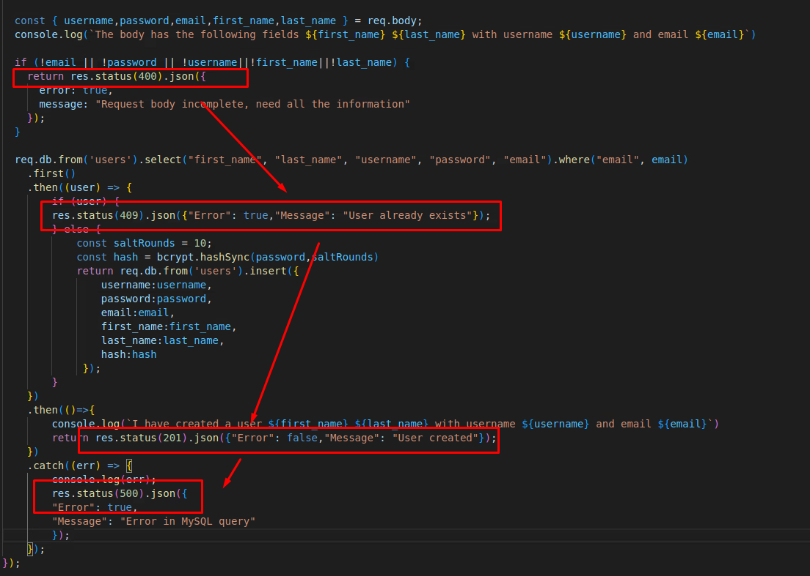

# Capstone Project - React Native "Book app"

## Youtube demo link: https://youtu.be/JgF3aJcUNxM


## Introduction
In this project I aimed to continue my quest to create some kind of good reads type app for my wife who loves to read and loves to organise her collection.
This app access the google books and open library API's to allow a user to browse and search for books and collect them into a watch area. The intended goal was to cross reference the two APIs using the open library api to provide recommendations based on the results of the google books api call. 
Additionally with a server backend there was hope that any searching and collecting done in the "book app" would be able to be restored to any device, but serverside updates were not solved in time, settling for inefficient and overloaded asynchronous storage.

The following is an image showing the main screen of the app after logging in.


From this screen users will search for books and add to a collection that is maintained between sessions but not between devices using the same credentials. See below for someones "book shelf".


In this project there was some integration with serverside but it is disappontingly incomplete at the time of submission. User authentication and registration works but insertion and removal of use book watchlists is not complete, mainly due to the complexity of the book objects since they have so many complex/nested fields.


In the picture above you can see a few different events in the server log.
The registration of a user called "big dog", their subsequent logging in, there attempts to remove book items from the database, which have a status code 200, but are not functioning correctly.
Then an attempt to remove an item by an unauthorized user was made which was blocked and several more attempts to insert or remove which are reporting code 200, ok but are all in fact abject failures as the books table is empty see below.


Hashing and salting was added after the first two users were added to the db.


## Technical Description

#### Landing Screen
I had no particular problems here but didn't over style things. It is a primitive landing page with two buttons that point to elements in a stack navigator on press. The buttons point the user to the login or registration screen and both buttons let one return to the home page with a back arrow at the top left of the header bar.

#### Show Watch List
Show watch list - I made frequent use of async storage for this, but cheekily I pass whole objects around in the async storage to avoid making more API calls. I'm not sure if I would try and build up my own copy over time of the google books library. Nobody wants to pay for storage.


#### Show items in current Watch List
I drop the contents of "Shelf" from the async storage into a flat list of cards from react native paper.


#### Navigation
I make use of stack and bottom tab navigators.
My stack navigator has about 5 routes in it and my bottom tab navigator displays entrypoints to the search area of the app and to the watch list area of the app.

#### User Styling Interface
I spent a lot of time wrestling with different list packages and components trying to find something that would let me have my left right split with a division and space underneath for details and buttons. I settled on react-native-paper to use flat lists of Cards that contain accordion lists.


#### Table/List/
I spent a lot of time wrestling with the formatting of flat lists and list accordions. There were a lot of issues getting scrolling to work on any kind of react-native-paper object. Eventually I discovered an arcane fix of putting a flex:1 style on a specific element above the flat list and it worked, but this caused other styling issues down the track, such as limiting what styles apply to individual cards on the book detail screen - causing more scroll failures and chopped off content.

#### Chart
No charts implemented this time, I did consider doing a pie chart breakdown of genres in a users watch list.

#### User Management (Register/Login/Logout)
On the client side there is a login and register button on the welcome/splash screen.
These two buttons block access to the main part of the app. Once a login attempt has been authenticated the user is navigated to the main screen.

There is a log out button, but it merely clears the users information from the async storage and boots the user back to the front page.
It does not clear the book watch list which persists between users and sessions. As a result an emergency override button was included with the app that when pressed clears the async storage.

I did manage to get user authentication and registration on the server side to work.
I even managed to setup most of the api status codes that go along with it.


|code|description|
|---|---|
|200| Passwords Match - OK|
|400| User does not exist/request body incomplete|
|401| Incorrect password|
|500| Database Error|

Then, for registration we have:




|code|description|
|---|---|
|201| User Created - Ok|
|400| Request body incomplete|
|409| User already exists|
|500| Database Error|

#### Server Functions
On my server I have many api routes enabled but the insert and delete items api's are not currently functional. I use knex throughout to perform secure queries, but then print passwords in the terminal with console.log to balance things out.
I had to add some middleware to allow cross origin policies, without it my web version of the app could not communicate with the server.


For reference the ip address of my server is: http://172.22.30.84:3000
This is hardcoded into my login screen, my register screen and my shelf context Provider ```shelfProvider```.


## Testing and limitations
#### Test plan
My test plan was ad-hoc but grueling.
Most elements that were added were clicked and interacted wtih countless times to explore all the behaviours they could produce.
For example, when it came to interactions between the search view and the shelf view I repeatedly clicked on books to and remove them to stress test response times and if my duplicate error handling was working.

Similarly with server side I would often make a request to the server insert/delete/register and then immediately shut down the server an look at the database to see if the contents had changed.


#### Glitches and Limitations
1. Require cycle: css 
Some sort of issue that I don't fully understand involving a ternary operator and different css sheets. I attempted to apply style sheets based on the clicked status of the search bar, it works pretty well, except for the continous yellow warnings that styles.js requires cycling, whatever that means. I didn't take time to fix this one as I thought the warnings were a small price to pay for a stylised search bar.

2. Log out button on android has no text. Not too sure why. Likely a text size issue where the text won't render because it won't fit. I didn't have time to fix that one.

3. JSON Parse error: Unexpected token: <] - Wasn't able to find the cause of this nor was I able to tell what problems it was causing.

4. Non serializable values were found in the navigation state. I suspect this is because of me bloating the async storage with a list of book objects. They are fairly heavy as text items go.

5. Scrolling on Book details pages
Very difficult to get scrolling to work for accordion lists. If they extend past the bottom of the page you don't get to scroll and find the elements underneath them. 
This problem is part of why I didn't develop the second API to be used on this page as I intended to place it underneath. I still call the API to show that I can, but I don't use it for anything - if you use the web version of the application you can see the contents of the api call print out in the console for my own satisfaction.

6. Inconsistent toasts on android and difficulty finding an adequate substitute on windows.
I tried to include toasts any time users "submitted" some information to confirm for the user that their input had done something. I had only partial success with this as when an item is added or removed from the watch list/shelf it will flash a toast. I could not find something similar for windows without regressing to modal elements in bootstrap.

## Discussion

#### Was Expo Native any good?
I find that when Expo Native works, it works really well and it's easy to get it going. When things don't work you don't have a chance of fixing them. Expo console will give you a stack trace of 50 functions and not a single one will be one of the ones you have written. I appreciate that you only need 4 or 5 lines of code to generate massive lists of complext content but between those 5 lines of code that I have written, and the execution are tens of thousands of lines of other peoples code that I can't scrutinise at all. A very frustating experience at its worse and a pleasant surprise at best.

#### How did it handle various screen sizes.
I barely tested this element of it at all. I tried to do some work with screen rotations but couldn't find the time to seriously invest in supporting it. I did try on my own android phone and an android emulator and spent a lot of my time testing in a web environment.

#### Accessibility?
My app is quite poorly implemented from a ui perspective, buttons are strange colours and unevenly/inconsistently arranged making it necessary for the user to be concentrating intently to know what they should be doing. Additionally I would say that my app is quite fragile and if too many buttons are pressed at once it could break or require a restart that not many would have the patience to do.
Additionally there I did not support anything that would enable screen readers or other accessibility tools for those with disabilities.

#### Social/Ethical/Legal issues
I can't think of any particular social/ethical/legal issues. I did wonder if there would not be some problem with rehosting links to the google books store and then associating them on the same page with books from the open library api, since they are open source. It is a bit of an ethical thing there that would be even worse if there were some kind of affiliate marketing or ad revenue kickback for me the developer.

## References

## Appendix 1 - Brief User Guide
- Load the app by doing npm start in the book-app directory.
- Access it on your phone/web browser or android emulator.
Choose between register and login on the home page.
Some sample user names that are currently registered are dog and cat.

|Name|username|password|
|---|---|---|
|big dog|dog|abc123|
|smol cat|cat|abc123|

Or register your own username and password. Once you've registered you'll be sent back to the main screen and from there you can login with your new credentials.
One you login you are sent to the main search page, from here you can type into the search bar and a list of relevant books will appear underneath the search bar once you submit your response by clicking the tick on the keyboard or pressing enter.

From there a list of Cards will display in a scrollable view. Click on a card and it will unravel a bit revealing a few more details and some buttons that invite you to add the book to your shelf or to view the book details.

If you view book details a similar screen containing only a single book will greet you, at the bottom of the card will be a button to buy the books from google books if pricing is available from them.
If you return to the search page by using the arrows in the top left of the screen, in the header, you'll return to the search and can now again add books to the watch list.

Then navigate to the watch list and peruse the books that have been added in another scrollable view.
This time when unravelled a remove book buttons will be revealed instead of an add book button, and click on that button will immediately remove that from the watch list/book shelf.

In the top right of the screen is a purple logout button, on android the text doesn't show, but on web it does. Click it to be placed on the splash page and signed out.
